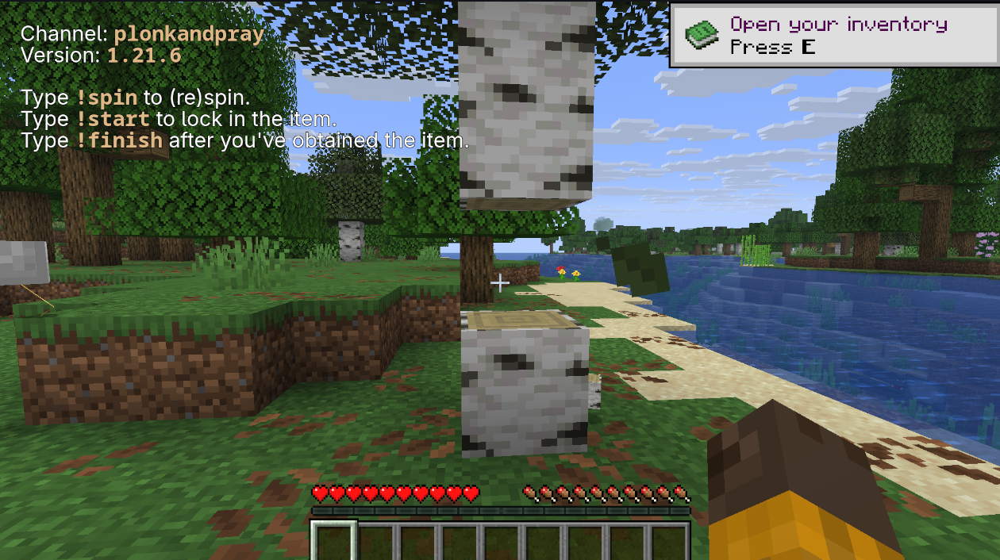

# About

MISO = minecraft item speedrun overlay

MISO let's you speedrun obtaining a random item in Minecraft. It is designed such that you add it as a browser source in OBS and control it via Twitch chat.

# How to use

1) Add a browser source to your OBS with the URL `miso.smolik.xyz/?channel=forsen` where `forsen` is a substitute for your Twitch channel.
2) Make sure the browser source resolution is the same as your OBS output (most likely 1920x1080).
3) Do !spin to spin the slot. You can also re-do it if you wanna respin.
4) To actually start the run with the selected block, do !start.
5) After you have obtained the item, do !finish.

# Acknowledgements
- For the database of all items for all versions: https://github.com/PrismarineJS/minecraft-data
- For the images of all blocks: https://mc.nerothe.com/
